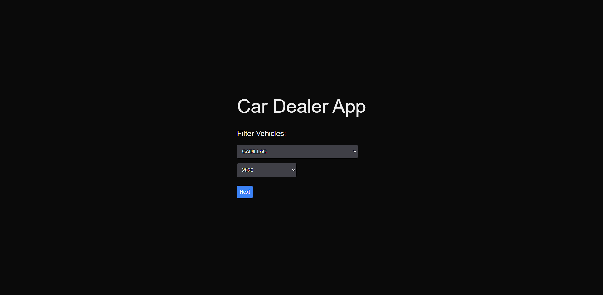
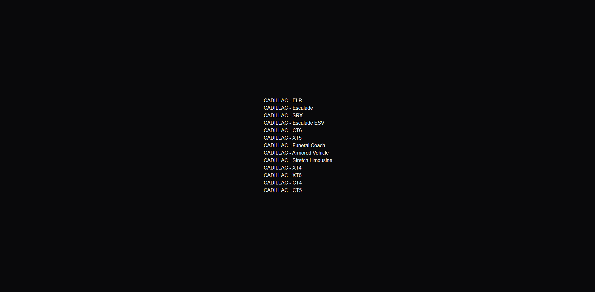

# Vehicle Filter App

This application allows users to filter vehicles by make and model year.

## Features
- Filter by vehicle make and model year
- View vehicle models on the result page
- Responsive design with Tailwind CSS

## Getting Started
1. Install dependencies: `npm install`
2. Run the development server: `npm run dev`
3. Build the application: `npm run build`
4. Run the production build: `npm run start`

## Technologies Used
- Next.js
- Tailwind CSS
- ESLint & Prettier